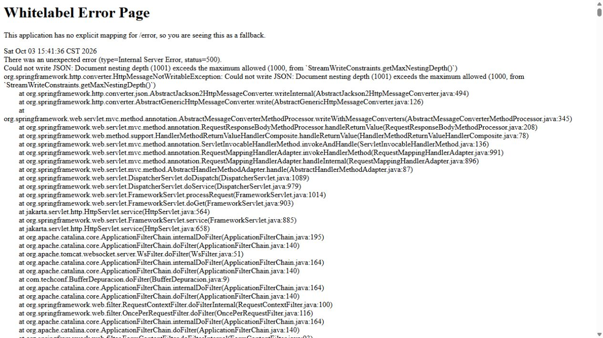

# Laboratorio 12 - TechConf

Konny Agüero Díaz · C5C089 · IF0009

Registro de charlas e inscripción de asistentes. Integra las prácticas 11.a y 11.b y la ampliación del laboratorio 12.

## Ejecución

Requisitos: Java 17 o superior, Maven 3.6.3 o superior y Node.js 22.12 o 24 con npm. El frontend utiliza Angular 20.

En una terminal:

```sh
cd backend
mvn spring-boot:run
```

En otra terminal:

```sh
cd frontend
npm ci
npm start
```

Abrir http://localhost:4200. El servidor escucha en http://localhost:8080.

La consola H2 está en http://localhost:8080/h2-console, con URL JDBC `jdbc:h2:mem:techconfdb`, usuario `sa` y contraseña `password`. La base es temporal: al reiniciar se restablecen las tres charlas, siete etiquetas y cinco asistentes de `data.sql`. La propiedad `spring.jpa.defer-datasource-initialization=true` permite ejecutar la semilla después de crear las tablas.

## Funcionalidad

- Registro y listado de charlas con título, expositor, nivel y correo.
- Fechas requeridas y validador cruzado que impide una fecha final anterior a la inicial.
- Etiquetas dinámicas con `FormArray`; se conserva al menos un campo obligatorio.
- Etiquetas persistidas con `@ElementCollection` en `charla_etiquetas`.
- Relación bidireccional `Charla` (`@OneToMany`) y `Asistente` (`@ManyToOne`).
- Botón de inscripción en cada tarjeta y `FormGroup` de asistente dentro de `inscripcionForm`.
- Nombre requerido de al menos tres caracteres, correo válido y edad entera mayor de 18 mediante un validador personalizado. La edad mínima aceptada es 19.
- Actualización de asistentes después de guardar y validación de los datos también en Spring Boot.

## API

| Método | Ruta | Función |
| --- | --- | --- |
| GET | `/api/charlas` | Consultar charlas con etiquetas y asistentes. |
| POST | `/api/charlas` | Registrar una charla. |
| POST | `/api/charlas/{id}/asistentes` | Inscribir un asistente; responde 201. |

Los datos inválidos producen HTTP 400. Inscribir en una charla inexistente produce HTTP 404.

## Parte 2: depuración de recursividad

1. Se retiró temporalmente `@JsonIgnore` del atributo `charla` de `Asistente.java`, conservando ambas relaciones JPA y sus getters.
2. Se compiló con `mvn -DskipTests package` y se ejecutó la versión de depuración desde `backend` con:

   ```sh
   java -jar target/techconf-0.0.1-SNAPSHOT.jar --server.port=8081 --server.error.include-message=always --server.error.include-stacktrace=always
   ```

3. Solo durante esa ejecución se agregó un filtro `BufferDepuracion` que llamaba a `response.setBufferSize(1048576)` antes de `chain.doFilter(request, response)`. Esto permitió que el servidor devolviera el estado 500 antes de enviar un JSON parcial al navegador.
4. Se abrió `http://localhost:8081/api/charlas` mediante GET. Jackson recorrió repetidamente `Charla.asistentes -> Asistente.charla -> Charla.asistentes`. El navegador mostró HTTP 500 y `HttpMessageNotWritableException: Document nesting depth (1001) exceeds the maximum allowed (1000)`. En esta versión Jackson interrumpe la recursión por su límite de profundidad antes de un `StackOverflowError`.
5. Se guardó la captura real en `docs/error_recursion.png`.
6. Se restauró `@JsonIgnore` en `Asistente.charla`, se eliminó el filtro temporal y se recompiló la aplicación. La anotación impide serializar la referencia de regreso a la charla, pero conserva la relación en H2 y permite devolver `Charla.asistentes`.
7. Con la solución restaurada, GET devuelve JSON válido con las tres charlas y sus cinco asistentes. El POST de inscripción devuelve el asistente sin incluir otra vez la charla.



La anotación `@JsonIgnore` también se aplica al getter de validación `isRangoFechasValido` para que ese resultado interno no aparezca como un campo de la API.

## Verificación

```sh
cd backend
mvn test
```

Las cinco pruebas comprueban semillas y serialización, inscripción y persistencia, rechazo de asistentes inválidos y charla inexistente, guardado de tres etiquetas y rechazo de fechas o etiquetas inválidas.

```sh
cd frontend
npm run build
```

En el navegador se comprobó el bloqueo por fechas invertidas, el registro de una charla con Docker, DevOps y CI/CD, los errores de nombre/correo/edad y la inscripción con edad 19. Al recargar se conservaron los datos durante la misma ejecución del servidor.
